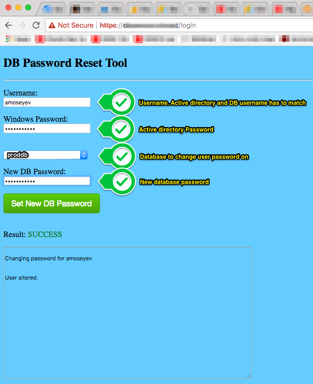

Oracle DB Password reset tool
====================


#### DB Password reset tool is super simple self-service web interface to allow user reset his/her own DB user password on database.

It consist of single web form as shown below:



And it does following:

- It authenticates user against Active Directory using "Username" and "Windows Password" fields. In this example AD Username is amoseyev.
- If authentication is successful it connect to database ("proddb" in this example). It connects to DB with password_reset_user user credentials. User has to have ALTER USER privilege.
- It resets password for DB user amoseyev to whatever is specified in "New DB Password" field in the form.

Note 1: AD username must match DB username. </br>
Note 2: DB user (amoseyev) has to be created explicitly. The tool does not create it. </br>

## Installation

Installation steps for any linux environment

#### Run below steps on DB host

1. On target database create user password_reset_user with permissions to change password for other users:

```Shell
SQL> create user password_reset_user identified by "*****";
SQL> grant alter user to password_reset_user;
SQL> grant connect to password_reset_user;
```

#### All below steps run on host where password reset tool is installed. "toolhost"

2. Install Oracle client software. (Instant client is good enough)

3. Create env file:

```shell
cat > ~/.profile_password_reset_tool <<EOF
export ORACLE_HOME=/opt/oracle/product/12.1.0.2
export PATH=${ORACLE_HOME}/bin:$PATH
EOF
```

4. Install oracle-db-password-reset tool

```shell
git clone https://github.com/AVM-Consulting/oracle-db-password-reset.git
cd oracle-db-password-reset
```

5. Adjust config.json to your environment

6. Adjust login.gtpl to your environment (need to modify lines 22-23. These are TNS names of databases where tool need to work on. Add more lines if needed)

7. Create SSL self signed certificate (needed for https). or use legit certificates if available.

```shell
openssl req -x509 -newkey rsa:2048 -keyout key.pem -out cert.pem -days 1000 -nodes
```

8. Start the tool

```shell
. ~/.profile_password_reset_tool
./login
```

9. Login to https://toolhost:9090/login and use it!


====================

Optionaly, Add lines to sqlnet.ora, so SSL connection from the SQL client is enforced, so passwords do not fly over net un-encrypted.

```Shell
export ORACLE_HOME=/opt/oracle/product/12.1.0.2
cat > $ORACLE_HOME/network/admin/sqlnet.ora <<EOF
# require encryption from client as password reset tool runs from this host.
SQLNET.CRYPTO_CHECKSUM_CLIENT = required
SQLNET.CRYPTO_CHECKSUM_TYPES_CLIENT = MD5
SQLNET.ENCRYPTION_CLIENT=required
SQLNET.ENCRYPTION_TYPES_CLIENT=AES128
EOF
```


## Support

For any support questions please contact us: info@avmconsulting.net

